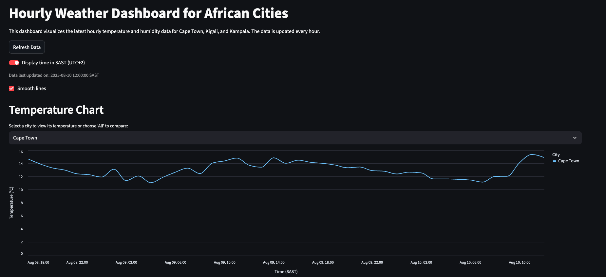
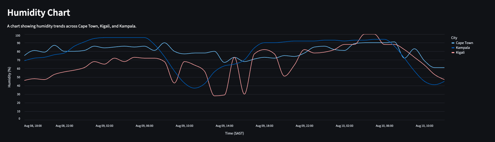

# Hourly Weather Data Pipeline and Dashboard

This project implements an automated data pipeline to fetch and store hourly weather data for Cape Town, Kigali, and Kampala, and a Streamlit application to visualize the data.

## Architecture

The system is composed of two decoupled components:

1. **Data Pipeline** (`weather_fetcher.py`): A Python script that runs on a schedule via GitHub Actions. It fetches hourly weather data from the OpenWeatherMap API and appends it to a CSV file in this repository.

2. **Dashboard** (`app.py`): A Streamlit application that reads the data from the CSV file and displays it as interactive time series charts.

This architecture is designed to be resilient to the "sleeping" behavior of Streamlit Community Cloud, where the dashboard is hosted.

## Public Dashboard

The live dashboard can be viewed at the following URL: https://app-weather-dashboard-7wbhcapt94vjwrv4bemz4n.streamlit.app/

## Setup Instructions

### 1. Fork and Clone the Repository

Fork this repository to your own GitHub account, then clone it to your local machine.

### 2. Set Up Python Environment

It is recommended to use a virtual environment.

```bash
python -m venv venv
source venv/bin/activate  # On Windows: venv\Scripts\activate
pip install -r requirements.txt
```

### 3. API Key Setup

This project requires an API key from OpenWeatherMap.

1. Sign up for a free account at [OpenWeatherMap](https://openweathermap.org/api).
2. Subscribe to the **One Call API 3.0** plan. It has a free tier of 1,000 calls/day.

#### For Local Development:
3. Create a `.env` file in the project root directory.
4. Add your API key to the `.env` file:
   ```
   OPENWEATHER_API_KEY=your_api_key_here
   ```

#### For GitHub Actions Deployment:
5. Go to your GitHub repository settings: `Settings` > `Secrets and variables` > `Actions`.
6. Create a new repository secret named `OPENWEATHER_API_KEY` and paste your API key as the value.

**Note**: The `.env` file is used for local testing, while the GitHub secret is used for the automated data pipeline that runs on GitHub Actions.

### 4. Running Locally

#### Running the Dashboard:
To run the Streamlit dashboard locally:

```bash
streamlit run app.py
```

#### Running the Data Pipeline:
You can also run the weather data fetcher script locally for testing:

```bash
python weather_fetcher.py
```

**Note**: The `weather_fetcher.py` script is designed to run automatically every hour via GitHub Actions when deployed. Running it locally is mainly for testing and development purposes.

### 5. Deployment

The dashboard is designed to be deployed on [Streamlit Community Cloud](https://share.streamlit.io/).

1. Push your repository to GitHub.

2. Sign in to Streamlit Community Cloud with your GitHub account.

3. Click "New app" and select your repository, the main branch, and the `app.py` file.

4. Click "Deploy!".

## How the Data Pipeline is Scheduled

The data fetching script (`weather_fetcher.py`) is scheduled to run automatically every hour using the GitHub Actions workflow defined in `.github/workflows/fetch_weather.yml`. This workflow checks out the code, runs the script to update `weather_data.csv`, and commits the changes back to the repository.

**Important Notes about Scheduling**:
- When deployed, the pipeline may not run exactly on the hour (e.g., exactly at 12:00, 1:00, etc.)
- GitHub Actions uses shared runners, and many users schedule jobs to run at the top of each hour
- This can cause delays, so your pipeline might run at times like 12:03, 1:07, etc.
- The system is designed to handle this variability and will still collect complete hourly data

## Sample Screenshots



